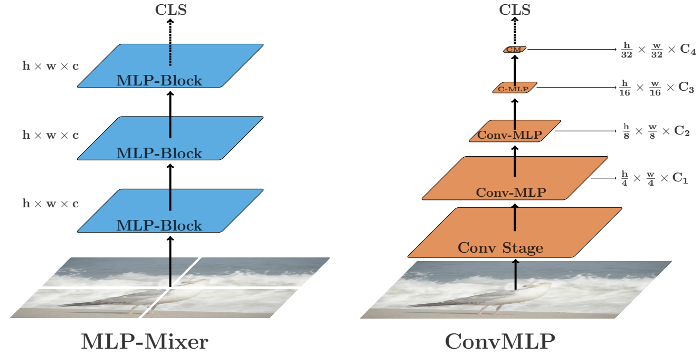

# convmlp-pytorch
(WIP) PyTorch implementation of ["ConvMLP: Hierarchical Convolutional MLPs for Vision" Li et al. (2021)](https://arxiv.org/abs/2109.04454v1)

</img>

## Usage

```python
import torch
from convmlp import ConvMLP

model = ConvMLP(
        num_classes = 10,
        in_channels = 3,
        hidden_dim = 64,
        ratio = 1,
        levels = 3,
        c = 3,
        m = 2,
)

x = torch.randn(1, 3, 256, 256)
model(x) # (1, 10)
```
